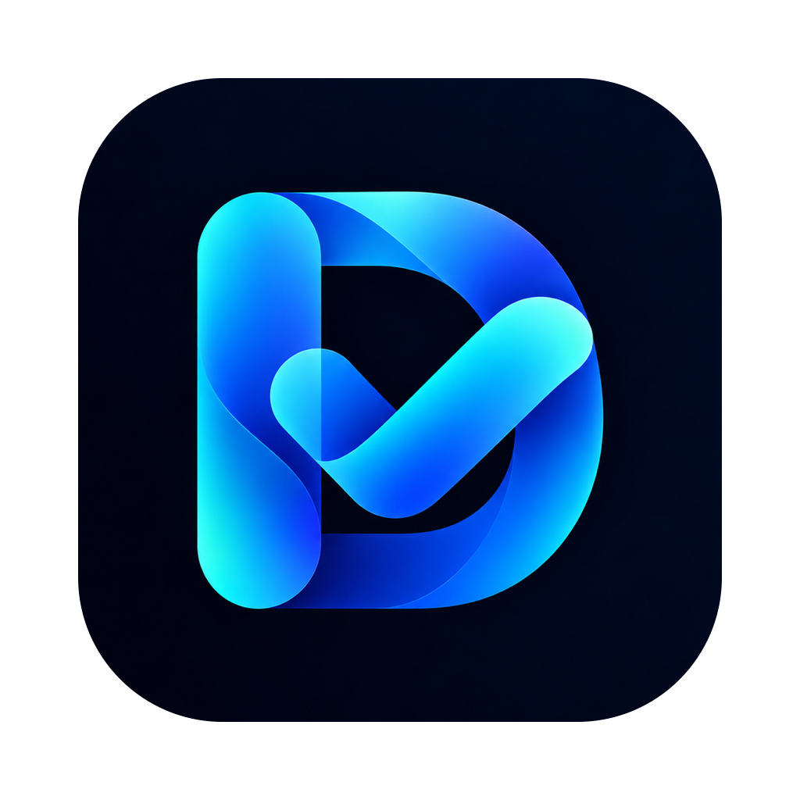
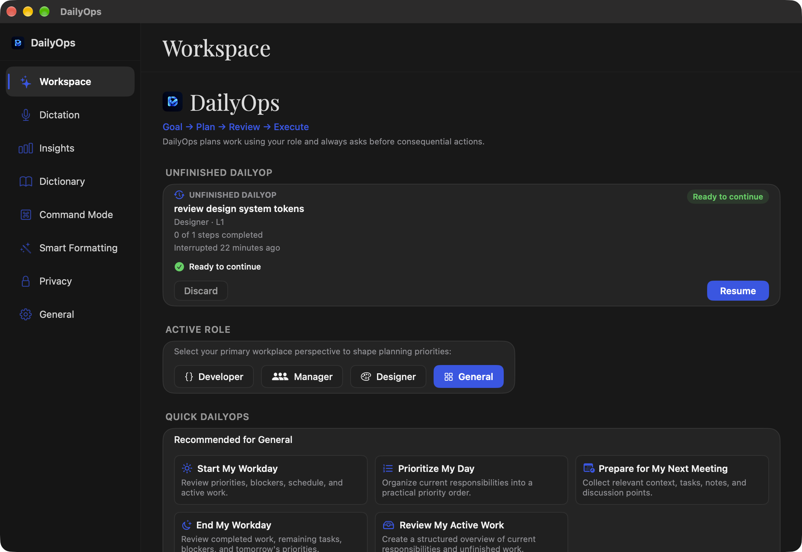

<p align="center">
  
</p>
<h1 align="center">DailyOps</h1>
<p align="center"><strong>Speak your work. See the plan. Stay in control.</strong><br>Local-first dictation and a role-aware work assistant for macOS.</p>
<p align="center">Apple Silicon · macOS 14+ · Swift 6 · MIT</p>

DailyOps combines desktop dictation, native voice commands, and a workspace for structured daily goals. Its current agent runtime uses deterministic planning and explicit approval gates, with persistent checkpoints and safe, user-initiated session restoration.

**Project status:** active development through Phase 5D2. The workspace, starter catalog, and resume interface are implemented. The agent layer is deliberately limited to its registered tools; workflow titles do not imply connected third-party services or autonomous completion of arbitrary work.

## At a glance

| Capability | Current implementation |
| --- | --- |
| Dictation | Configurable hotkeys, microphone capture, transcript HUD, insertion at the cursor, and local history |
| Speech recognition | Automatic Apple Speech → local fallback; selectable Apple Speech, Parakeet, and Whisper engines |
| Text formatting | Deterministic filler removal, spoken punctuation, spelling correction, typography, and custom vocabulary |
| Native voice commands | Application and browser actions, custom commands, WhatsApp recipient resolution, Calendar, and Reminders command paths |
| DailyOps workspace | Goal input, role selection, activity and task status, approvals, and unfinished-session controls |
| Roles | Developer, Manager, Designer, and General |
| Agent tools | Open an application, get the current time, inspect basic system status, and create a local note |
| Persistence | Schema v2 snapshots, exact tool parameters, checkpointing, restoration assessment, and explicit resume |
| Branding | Appearance-aware in-app branding and a complete macOS AppIcon asset catalog |

## The workspace



Choose a role, type or speak a goal, and inspect the resulting plan and activity. Consequential registered actions pass through the permission flow. Selecting a starter supplies a goal to the same planning pipeline.

The eight built-in starters are **Start My Workday**, **Prepare for Tomorrow's Review**, **Prepare My Standup**, **Prioritize My Day**, **Prepare for My Next Meeting**, **Check My Blockers**, **End My Workday**, and **Review My Active Work**.

These are entry points, not eight independently complete integrations. The planner has dedicated workday and review branches plus application-launch and local-note handling; other inputs may produce generic tasks. Some role plans contain descriptive tasks without executable tools. References such as `github_issues` and `calendar_events` are not registered agent tools and can be reported as unsupported. Calendar and Reminders support in the separate native command engine does not connect them to the agent registry.

### Resume safely

Unfinished sessions can be reviewed in the workspace before continuation. The restoration path retains the session identity and tool parameters, skips completed tasks, and does not reuse old approvals. Interrupted mutations require explicit retry confirmation, followed by the applicable permission approval. Failed, unsupported, inconsistent, or incompatible snapshots can require manual review rather than automatic execution.

## Speech and privacy

| Engine | Availability and behavior |
| --- | --- |
| Automatic (default) | Tries Apple Speech, then Parakeet, then Whisper when needed |
| Apple Speech | On-device SpeechAnalyzer/SpeechTranscriber; requires macOS 26+ and a supported language |
| Parakeet | FluidAudio-backed local recognition with live transcript support |
| Whisper | WhisperKit-backed local recognition; English and multilingual sizes, including Large v3 Turbo |

Microphone permission enables capture; Accessibility permission enables hotkeys and text insertion. Contacts, Calendar, and Reminders permissions are needed for their respective commands. Onboarding and Settings guide configuration.

Speech models or language assets may require downloads from model providers or Apple. Transcription and deterministic cleanup run locally; history, agent notes, and session data are stored on the Mac. Browser navigation and communication commands can interact with external apps and online services. Local storage is not a guarantee that actions launched by the user stay offline.

Local Text Cleanup uses deterministic local formatting and respects the speech cleanup, punctuation, spelling, and typography preferences. It does not make an LLM request. No cloud AI key is required for the current runtime. Smart Polish action labels do not currently represent distinct semantic rewrite or summarization implementations.

## Build and run

Requirements: an Apple Silicon Mac, Xcode 26 or later with its command-line tools, and [XcodeGen](https://github.com/yonaskolb/XcodeGen). The deployment target is macOS 14; Apple Speech itself requires macOS 26. Intel builds are not configured.

```sh
git clone https://github.com/akshaywesleykothapalli/dailyops.git
cd dailyops
xcodegen generate
open DailyOps.xcodeproj
```

Select the **DailyOps** scheme to build and run. Swift Package Manager resolves [FluidAudio](https://github.com/FluidInference/FluidAudio) and [WhisperKit](https://github.com/argmaxinc/WhisperKit); dependency resolution needs network access.

For a local Release build, signing, installation to `/Applications`, and launch:

```sh
./scripts/install.sh
```

The installer chooses `CODESIGN_IDENTITY` when supplied, then Developer ID, Apple Development, or ad-hoc signing. A stable signing identity helps preserve macOS permission grants across rebuilds. Installation replaces the existing `/Applications/DailyOps.app`. A local build is not automatically a notarized distribution.

If your Xcode selection differs, set `DEVELOPER_DIR` to the intended Xcode installation. The install and packaging scripts detect `/Applications/Xcode-beta.app` when no override is supplied.

## Verify

```sh
xcodegen generate
xcodebuild -project DailyOps.xcodeproj -scheme DailyOps \
  -destination 'platform=macOS,arch=arm64' -derivedDataPath build \
  build CODE_SIGNING_ALLOWED=NO
xcodebuild -project DailyOps.xcodeproj -scheme DailyOps \
  -destination 'platform=macOS,arch=arm64' -derivedDataPath build \
  test CODE_SIGNING_ALLOWED=NO
```

The test target includes XCTest and Swift Testing coverage for commands, planning, permissions, checkpoints, restoration, resume execution, and the starter catalog. Check the output from both frameworks when assessing the full suite.

## Repository guide

| Path | Purpose |
| --- | --- |
| `DailyOpsApp/Sources/` | SwiftUI interface, dictation services, native command engine, and app lifecycle |
| `DailyOpsApp/Sources/DailyOpsCore/` | Goals, roles, tools, deterministic agents, execution, permissions, and persistence |
| `DailyOpsApp/Resources/` | App icon and bundled resources |
| `Branding/` | Supplied light and dark DailyOps source artwork |
| `Tests/` | XCTest and Swift Testing suites |
| `project.yml` | Authoritative XcodeGen configuration; generated `.xcodeproj` is ignored |
| `scripts/` | Build/install, packaging, and icon generation helpers |

### App icon and packaging

Run `./scripts/make-icon.sh` to generate all ten macOS icon sizes and `AppIcon.icns` from `Branding/DailyOps-Dark.png`. The source artwork is preserved. `project.yml` selects `AppIcon` for asset compilation and bundle metadata, so regenerating the Xcode project retains the configuration. The installer re-registers the installed bundle with Launch Services.

`./scripts/package.sh` builds a DMG and attempts notarization only when a Developer ID identity and the `dailyops-notary` keychain profile are available. Public signing, notarization, and release artifact availability must be verified separately before distribution.

## Planned / not yet implemented

- Connected GitHub issues, pull requests, and CI data in the DailyOps agent tool registry.
- Agent integrations for communication, design, and knowledge services beyond the existing native command paths.
- Dedicated executable behavior for every starter workflow and broader arbitrary-goal planning.
- Distinct semantic rewrite, formalization, concision, and summarization implementations for Smart Polish.
- A verified public release pipeline with downloadable, signed, notarized builds.

These describe future work, not current product guarantees. Phase 6 work is outside this release-prep checkpoint.

## Contributing and license

See [CONTRIBUTING.md](CONTRIBUTING.md) for contributor guidance. Keep `project.yml` as the source of truth, run the full test suite, and preserve approval and restoration safeguards when changing execution behavior.

DailyOps is distributed under the [MIT License](LICENSE). Existing copyright notices are retained. Thanks to FluidAudio, WhisperKit, and the underlying local speech-model projects.
